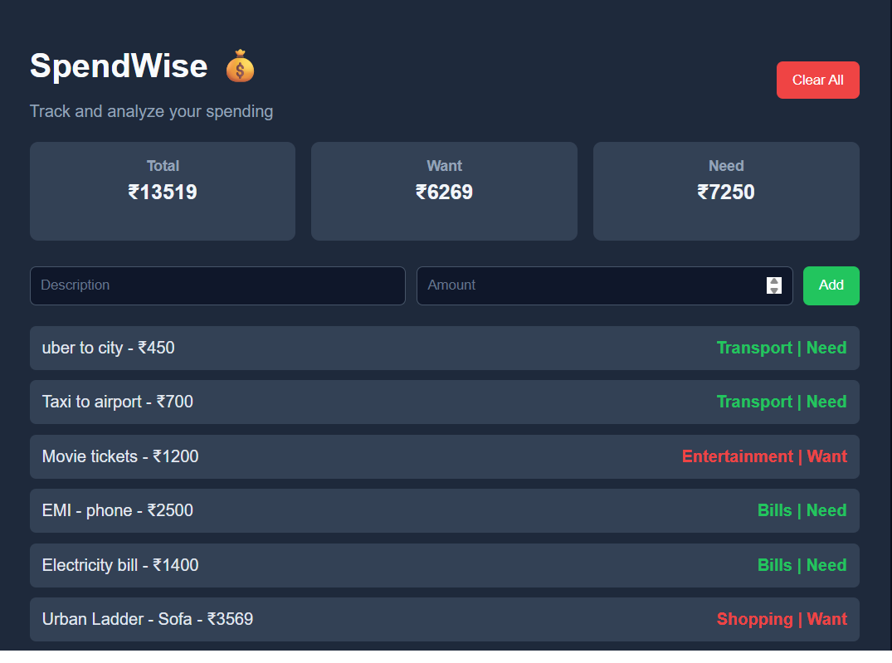
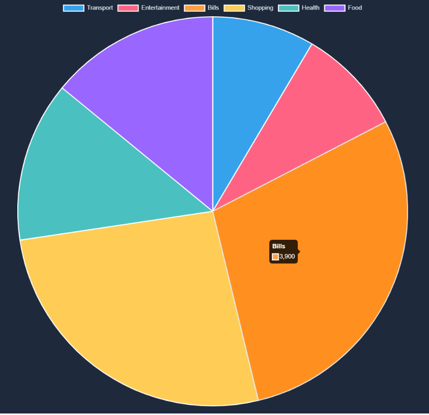

# 💰 SpendWise — AI-Powered Financial Intelligence Dashboard

> A full-stack machine learning system that classifies transactions and delivers real-time financial insights.

## 📸 Screenshots

### 🖥️ Dashboard


### 📊 Spending Distribution (Pie Chart)

---

## 🚀 Overview

SpendWise is an intelligent personal finance tracker that combines **Natural Language Processing (NLP)**, **Machine Learning**, and **real-time analytics** to help users understand their spending behavior.

Unlike basic trackers, SpendWise introduces a **hybrid ML + rule-based system** to classify transactions and generate meaningful financial signals.

---

## 🧠 Core Features

### 🔍 Smart Transaction Classification

* Uses **CountVectorizer (NLP)** to convert text → numerical features
* ML model predicts categories:

  * Food, Transport, Shopping, Entertainment, Bills, Health

---

### 🧠 Hybrid Intelligence System

* **ML Layer** → Predicts category from description
* **Logic Layer** → Uses amount thresholds for:

  * Want vs Need classification

```text
Description → ML → Category → Logic → Want/Need
```

---

### 📊 Real-Time Analytics Dashboard

* Total spending
* Want vs Need breakdown
* Category-wise aggregation

---

### 📈 Data Visualization

* Interactive **pie chart (Chart.js)**
* Visual breakdown of spending patterns

---

### ⚡ Full CRUD API

* Add transactions
* Fetch transactions
* Clear all transactions

---

## 🛠️ Tech Stack

| Layer         | Technology                                                         |
| ------------- | ------------------------------------------------------------------ |
| Backend       | Django, Django REST Framework                                      |
| Frontend      | HTML, CSS, JavaScript                                              |
| ML/NLP        | Scikit-learn (CountVectorizer, Logistic Regression / RandomForest) |
| Visualization | Chart.js                                                           |
| Database      | SQLite                                                             |

---

## 🧠 System Architecture

```text
User Input
   ↓
Frontend (JS Fetch API)
   ↓
Django REST API
   ↓
ML Model (NLP Classification)
   ↓
Business Logic Layer
   ↓
Database Storage
   ↓
Analytics + Visualization
```

---

## 📂 Project Structure

```text
SpendWise/
│
├── backend/
│   ├── transactions/
│   ├── train_model.py
│   ├── manage.py
│
├── frontend/
│   └── index.html
│
├── screenshot.png
└── README.md
```

---

## ⚙️ Setup Instructions

### 1. Clone Repository

```bash
git clone https://github.com/arnavagrrr/SpendWise.git
cd SpendWise
```

---

### 2. Create Virtual Environment

```bash
python -m venv venv
venv\Scripts\activate
```

---

### 3. Install Dependencies

```bash
pip install django djangorestframework scikit-learn pandas django-cors-headers
```

---

### 4. Train Model

```bash
cd backend
python train_model.py
```

---

### 5. Run Server

```bash
python manage.py runserver
```

---

### 6. Launch Frontend

Open:

```text
frontend/index.html
```

---

## 🎯 Key Highlights

* Designed a **hybrid ML system** combining NLP + rule-based reasoning
* Built a **full-stack application** with REST APIs and frontend integration
* Implemented **real-time analytics dashboard**
* Integrated **data visualization for financial insights**
* Solved **real-world ML generalization issues using fallback logic**

---

## 📌 Future Improvements

* User authentication system
* Cloud deployment (AWS / Render)
* Advanced ML model (BERT / embeddings)
* Budget tracking & alerts
* Personalized financial recommendations

---

## 👨‍💻 Author

**Arnav Agarwal**

---

## ⭐ If you like this project

Give it a ⭐ — it helps!
